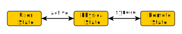

\page Serialize Serialization & Synchronization

# Serialization & Synchronization

Serialization is built into the engine core itself. The serialization library splits data layout, storage and format into separate units, allowing full flexibility in serialization. For example, the same meta information can be used to serialize to the filesystem in human readable form or over the network in binary form. The library is built for object-oriented design, storing meta information for each class. Synchronization is happening in a server-client model. 

## Fundamental Data Types

The serialization library supports a set of fundamental types:
- fundamental C++ types
- ByteBuffers
- strings
- pointers to serializable classes
- void (useful for template code)

All serialized data has to be a compound of the fundamental data types

## Unit Hierarchy

A compound type is called a unit. To keep the memory overhead of the serialization system minimal there exist multiple different types of serializable units, with different capabilities. They each inherit from it's predecessor. To make a type serializable it has to inherit from one of the unit types and define a SerializeTable (see below).

### Data Units

Data Units are the minimal base class. They do not carry any information and therefor do not increase the size of the type (due to empty base optimization). The SerializableDataUnit class can be seen as a simple tag.

### Serializable Units

Serializable Units store additional information. They store an index indicating the current activation progress (see State Replication/Activation). They also store a flag showing whether the unit is synchronized at the moment. Note that for this to be set no actual synchronization has to be setup. It only marks the unit as initialized and ready for synchronization. Also it stores a pointer to its own top-level unit. The last two pieces of data are not needed by the serializable unit itself, but rather have to be propagated through the hierarchy to allow syncable units to function properly.

### Syncable Units

Syncable Units store a pair of ids that uniquely identify the unit to all participants of the synchronization. Furthermore, it stores the type of the unit in form of a pointer to its SerializeTable. If marked synchronized, syncable units will communicate all changes to synchronized members with all associated servers/clients.

### Top-Level Units

Synchronization replicates an object hierarchy between multiple machines and keeps the state of those objects synchronized on all participating servers/clients. To have better control of what exactly is synchronized all units that need to be synchronized need to be the child of a top-level unit. SyncManagers are used to configure which top-level units are to be synchronized which way.

## SerializeTables

SerializeTables are similar to VTables a constant representation of a serializable/synchronizable type. They are defined in the `.cpp` of a type and describe all members of that type. When invoking a serialize instruction, the type system is able to retrieve the correct SerializeTable for the operation. For synchronization this type information is not always statically available, which is why syncable units store their SerializeTable pointer internally. An example table could look like this:

```
SERIALIZETABLE_BEGIN(My::Namespace::Unit)
FIELD(Name)
ENCAPSULATED_FIELD(Task, getCurrentTask, setCurrentTask)
ENCAPSULATED_POINTER(AttackTarget, getAttackTarget, setAttackTarget)
SYNCFUNCTION(takeDamage)
SERIALIZETABLE_END(My::Namespace::Unit)
```

SerializeTables are defined within a `BEGIN`/`END` pair. The definition shall not be put inside of a namespace. The most commonly used entries of a SerializeTable are shown in the example:
- `FIELD(<name>)` adds the member variable `<name>` to the table. Serialization is performed according to the variable type.
- `ENCAPSULATED_FIELD(<name>, <getter>, <setter>)` adds the field `<name>` to the table. On Serialization the value returned by the `<getter>` function is serialized and on Deserialization that value is fed back to the `<setter>` function.
- `ENCAPSULATED_POINTER(<name>, <getter>, <setter>)` behaves like `ENCAPSULATED_FIELD` with one exception. `<name>` has to be a pointer variable of the described type. This is necessary, because the system needs to store some intermediary data when serialization pointers.
- `SYNCFUNCTION(<name>)` adds the function `<name>` to the list of synchronizable functions, which can be requested from clients and broadcast from servers to all clients.

## Streams

The serialization library is stream based. The stream system is based on the C++ `<iostream>` system. This means that every `std::basic_streambuf` implementation can be used to define the way the data is stored/retrieved. The only difference is that the streams used in the library are holding a `std::unique_ptr` to their stream buffer as opposed to a raw pointer in the STL. This makes it possible to define a cheap move operation on streams, which is very useful in different scenarios.

There exist multiple internal stream types, but the important user facing stream types are FormattedSerializeStream and FormattedBufferedStream.

### FormattedSerializeStream

The FormattedSerializeStream combines two features of serialization: The format and the storage. Storage is provided by a `std::unique_ptr<std::basic_streambuf>` as mentioned above. The Formatter is also provided by a unique pointer and provides an implementation to the Formatter interface. This interface is designed to allow arbitrary data formats with the only restriction being that all serialized data must appear in order according to the unit hierarchy. The engine comes with a few predefined Formatters: type-checked binary, unchecked binary, XML, JSON and Ini.

### FormattedBufferedStream

The FormattedBufferedStream behaves the same as a FormattedSerializeStream with the only exception, that the used stream buffer has to inherit from `message_streambuf`. This converts the stream into a message based stream, which is necessary for synchronization. Using the wrapper type `buffered_streambuf` any `std::basic_streambuf` can be used as a `message_streambuf`.

## Managers

Managers serve multiple purposes. On the one hand, they store some additional data needed for synchronization. On the other hand, they are responsible for organizing and setting up streams. It is common practice to define a manager for a given storage type (e.g. NetworkSerializeManager, FilesystemSerializeManager, MemorySerializeManager). There exist two types of Managers:
- A SerializeManager stores the id mapping for the unit hierarchy.
- A SyncManager inherits from SerializeManager and additionally stores a list of its associated top-level units.

## State Replication

When dealing with serialization/synchronization there exist multiple semantical states of data:
- The physical state is the actual data stored in memory at any given time.
- The user state is what has been made visible to the user through activation.
- The remote state is the data source/target for serialization or the server/client for synchronization.



The `synced` attribute of a unit is only relevant for synchronization uses. During serialization/deserialization the physical state is stored into the remote state or read from respectively. In a synchronization scenario the flag `synced` indicates wether the unit is currently synchronized with a remote state. This operation can occur atomically from the user perspective as all data can be transferred from one state into the other without any user code interfering. Similarily, the `active` flag indicates a link between the user state and the physical state. This link is much harder to maintain as the user will be updated about any changes via callbacks, which might in turn perform arbitrary changes to the data itself. Due to the callbacks the updating of the user state can not happen atomically. Therefore, the activation link has to be well defined.

### Activation

Activation is only relevant during deserialization as serialization is not changing any state. The necessary steps for deserialization are as follows:

1. Deactivate the object hierarchy:
    1. while active index > 0:
        1. decrement active child index
        2. recursively deactivate last active child (1.)
    2. Invoke deactivation callbacks
2. Read into the physical state from the remote state
3. Activate the object hierarchy:
    1. Invoke activation callbacks
    2. while active index < child count:
        1. recursively activate first inactive child (3.)
        2. increment active child index

Note that compound units/containers store an index indicating activation progress. For that reason the activation state of an object can only be queried from its parent. `SerializableContainer::end()` returns an iterator defined by the activation index. This means that during activation only parts of the container are visible to the user. When operating on an object, callbacks are only called, if the object is active at that moment. If an object is inserted into a container before the activation index, it will be activated immediately and callbacks are invoked. If it is inserted after the activation index, nothing will be done. If the parent is currently deactivated/deactivating, no callback would be necessary at all. If the parent is currently activating, the index will be incremented further and ultimately activate the newly inserted object.

The activation system removes many constraints that would otherwise be necessary within the callback implementations. Still, changes to a container/unit during deserialization should be treated with great caution as they could lead to state inconsistencies.